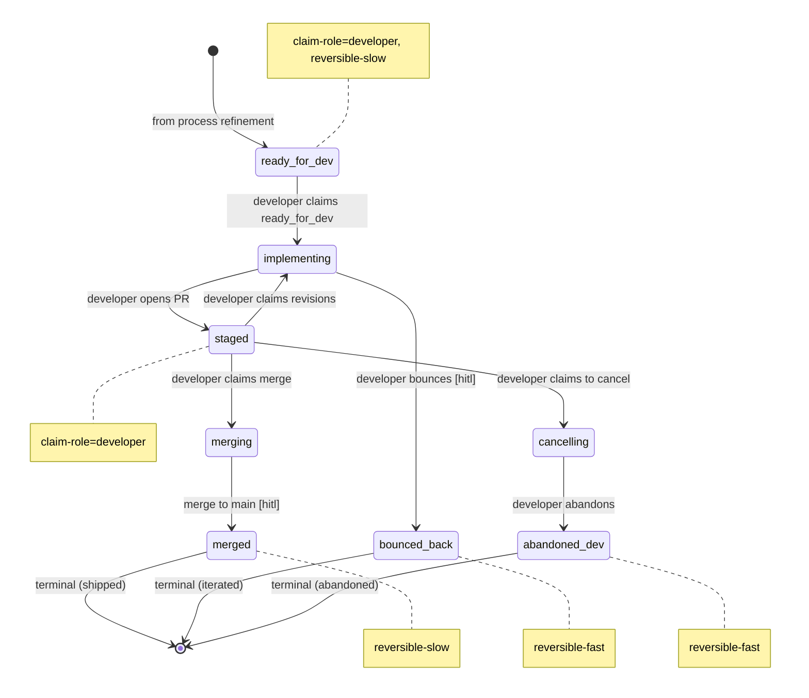

# Process: inner-loop

> Defined in: `inner-loop-states.json`
> HCP catalog: `inner-loop-hcps.json`

## Issue types accepted

- `bug` — **Bug**: Defect in shipped behavior — something is broken or wrong.
- `feature` — **Feature**: New user-facing capability or enhancement to existing behavior.
- `task` — **Task**: Tracked work that isn't a bug or feature — refactors, dependency bumps, infrastructure changes.

## State diagram

## States

| Name | Class | Reversibility | Claim role | Terminal taxonomy | Close reason |
|---|---|---|---|---|---|
| `ready_for_dev` | resting | reversible-slow | developer | — | — |
| `implementing` | working | — | — | — | — |
| `staged` | resting | — | developer | — | — |
| `merging` | working | — | — | — | — |
| `cancelling` | working | — | — | — | — |
| `merged` | terminal | reversible-slow | — | shipped | completed |
| `bounced_back` | terminal | reversible-fast | — | iterated | — |
| `abandoned_dev` | terminal | reversible-fast | — | abandoned | not planned |

## Transitions

| From | To | Type | Label | Gate | HITL level |
|---|---|---|---|---|---|
| `[*]` | `ready_for_dev` | cross_process | 'from process refinement' | — | — |
| `ready_for_dev` | `implementing` | claim | 'developer claims ready_for_dev' | — | — |
| `implementing` | `staged` | role_action | 'developer opens PR' | — | — |
| `implementing` | `bounced_back` | role_action | 'developer bounces' | bounce_back | audit |
| `staged` | `implementing` | claim | 'developer claims revisions' | — | — |
| `staged` | `merging` | claim | 'developer claims merge' | — | — |
| `merging` | `merged` | role_action | 'merge to main' | merge_to_main | block |
| `staged` | `cancelling` | claim | 'developer claims to cancel' | — | — |
| `cancelling` | `abandoned_dev` | role_action | 'developer abandons' | — | — |

## HCPs (Human Control Points)

### `merge_to_main` — block

- **Source state**: `merging`
- **Destinations**: `merged`
- **Triggering role**: `developer`
- **HCP type**: judgment
- **Destination reversibility**: reversible-slow
- **Allowed levels**: block, audit
- **Default level**: block
- **Agent prepares**: `merge-packet-template.md`

> Code review is the canonical pre-merge gate. Reversible-slow (revert PR is possible but disruptive), so block-by-default. Teams with strong CI and high autonomy can earn audit via trust grant.

### `bounce_back` — audit

- **Source state**: `implementing`
- **Destinations**: `bounced_back`
- **Triggering role**: `developer`
- **HCP type**: judgment
- **Destination reversibility**: reversible-fast
- **Allowed levels**: block, audit
- **Default level**: audit
- **Agent prepares**: `bounce-back-note-template.md`

> When the developer judges that the refined packet is wrong, kick it back. Reversible-fast (PM can immediately re-refine) so audit-by-default. The PM reviews retroactively to catch bounce-back patterns.

## Cross-process handoffs

**Entries** (issues arriving from other processes):

- `ready_for_dev` ← process `refinement` (shared) — `from process refinement`
