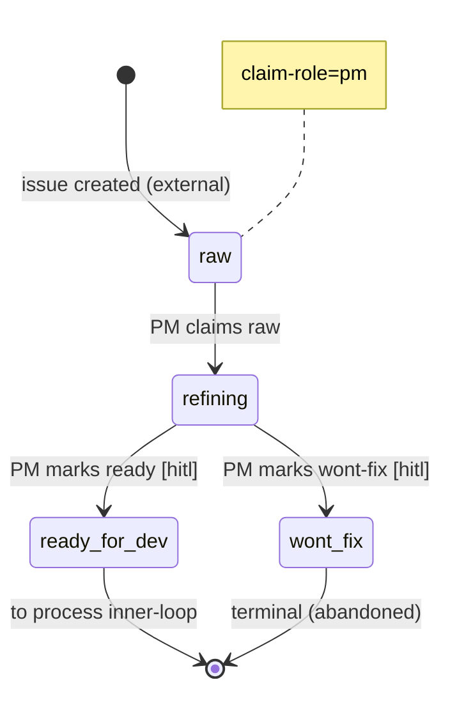

# Process: refinement

> Defined in: `refinement-states.json`
> HCP catalog: `refinement-hcps.json`

## Issue types accepted

- `bug` — **Bug**: Defect in shipped behavior — something is broken or wrong.
- `feature` — **Feature**: New user-facing capability or enhancement to existing behavior.
- `task` — **Task**: Tracked work that isn't a bug or feature — refactors, dependency bumps, infrastructure changes.

## State diagram

## States

| Name | Class | Reversibility | Claim role | Terminal taxonomy | Close reason |
|---|---|---|---|---|---|
| `raw` | resting | — | pm | — | — |
| `refining` | working | — | — | — | — |
| `ready_for_dev` | resting | reversible-slow | — | — | — |
| `wont_fix` | terminal | reversible-fast | — | abandoned | not planned |

## Transitions

| From | To | Type | Label | Gate | HITL level |
|---|---|---|---|---|---|
| `[*]` | `raw` | external | 'issue created (external)' | — | — |
| `raw` | `refining` | claim | 'PM claims raw' | — | — |
| `refining` | `ready_for_dev` | role_action | 'PM marks ready' | ready_for_dev | audit (default block) |
| `refining` | `wont_fix` | role_action | 'PM marks wont-fix' | wont_fix | audit |
| `ready_for_dev` | `[*]` | cross_process | 'to process inner-loop' | — | — |

## HCPs (Human Control Points)

### `ready_for_dev` — audit _(relaxed from block via active trust grant)_

- **Source state**: `refining`
- **Destinations**: `ready_for_dev`
- **Triggering role**: `pm`
- **HCP type**: judgment
- **Destination reversibility**: reversible-slow
- **Allowed levels**: block, audit
- **Default level**: block
- **Agent prepares**: `ready-packet-template.md`

> PM judges whether the ticket is well-scoped enough to hand to a developer. Reversible (the dev can bounce it back) but slow (work has started), so block-by-default until a team earns audit via trust grant.

### `wont_fix` — audit

- **Source state**: `refining`
- **Destinations**: `wont_fix`
- **Triggering role**: `pm`
- **HCP type**: judgment
- **Destination reversibility**: reversible-fast
- **Allowed levels**: block, audit
- **Default level**: audit
- **Agent prepares**: `wont-fix-note-template.md`

> Low-stakes triage call; closing a wont-fix is reversible-fast (reopen the issue), so audit-by-default. Teams who want every wont-fix to pause for review can tighten back to block via trust grant.

## Cross-process handoffs

**Exits** (issues handed to other processes):

- `ready_for_dev` → process `inner-loop` (shared) — `to process inner-loop`

## Active trust grants

Per-team relaxations of catalogued HCP levels. Grants expire and must be re-justified with evidence.

### `ready_for_dev` (team: example-team)

- **Effective level**: audit
- **Granted by**: team-lead@example.com
- **Granted at**: 2026-05-01
- **Expires at**: 2026-08-01
- **Review cadence**: monthly
- **Audit cadence**: weekly
- **On revoke**: re-refine and re-attempt ready packet

**Evidence**:
- eval: 92% PM-marked-ready tickets accepted by developer over last 60 tickets (2026-02-01..2026-04-30) — evals/refinement/ready-acceptance.md
- manual: Team lead sign-off after retro on three contested bounce-backs (rationale-as-of 2026-05-01) — retros/2026-05-refinement-trust.md
