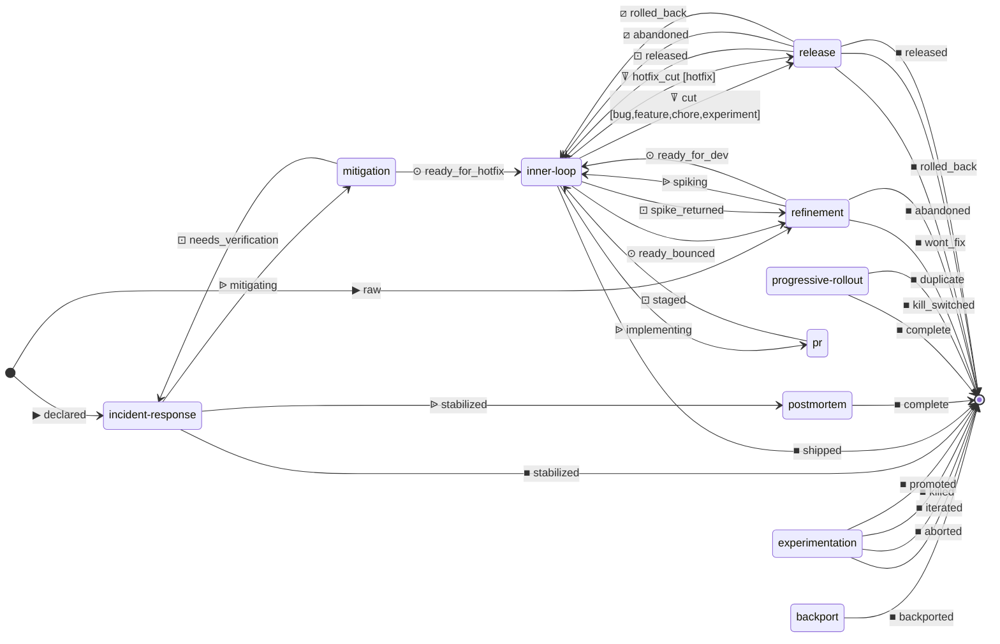

# Workflow

Generated documentation for the processes defined in this workflow.
Authored sources are the `*.json` files; regenerate with `workflow generate-docs`.

## Process map

Auto-generated overview of every process in this workflow and the handoffs between them. The canonical source is each `<process>-states.json`; the diagram is regenerated from those.

Rendered as a `stateDiagram-v2` so it shares the visual language of the per-process state diagrams. Nodes are processes; the built-in `[*]` sentinel marks external entry (top) and external exit (bottom). The diagram reads top-to-bottom: new issues flow from `[*]`, through processes (handoffs and spawns between them), and back to `[*]` as each terminal state is reached.

Edge labels carry a symbol prefix indicating the relationship kind:

- **`▶ <state>`** — entry: a new external issue materializes at the labelled state.
- **`■ <state>`** — exit: an issue closes at the labelled terminal **and** no parent process has it listed as a spawn feedback target. Terminals named in some sibling's `spawn.advance_on` are treated as feedback (the work continues in the parent) and don't render as workflow exits, even though the child issue itself closes.
- **`⊙ <state>`** — handoff: the same work item continues on the destination process. Bidirectional handoffs (each side both sends and receives) emit two edges in opposite directions.
- **`ᐉ <parent_state>`** — spawn: the source process creates a child issue on the destination process. The label names only the parent state where the spawn fires; check the destination's own diagram for the child's initial state.
- **`ꘜ <collector_state>`** — collect: the destination process (authored via `collects`) gathers contributors from another process. The label names only the collector state; the source's `from_states` are visible on the source process's own diagram.
- **`⊡ <state>`** — feedback: for a spawn's `advance_on`, the parent's next state after the child terminates. For a collect's `advance_on`, the collector's state that triggers contributor movement. Pairs with the originating `ᐉ`/`ꘜ` edge to show the round-trip; the trigger / target counterpart is visible on the relevant process's own diagram.
- **`⧄ <collector_state>`** — release: a collect's `release_on` entry. When the collector enters the labelled state, every contributor's `collected-by:<collector>` marker is cleared but no state change happens — the contributors are released back to candidacy and become eligible for a future collector.

Edge labels name the state involved — the shared resting state for handoffs, or the originating → destination state pair for spawns.

The raw mermaid source is also available at [`process-map.mermaid`](./process-map.mermaid).

**What this map does NOT show:** editorial groupings (Build / Ship lanes), edge tiers (happy path vs feedback), or rolled-up labels. Each shared state appears as its own edge.

## Processes

- [`backport`](./backport.md) — Cherry-pick a fix from the trunk to a maintenance branch. Triggered post-merge when a release manager elects to ship the fix on an older line; closes once the patch release ships.
- [`experimentation`](./experimentation.md) — Measure a flag-gated experiment in production and reach a verdict — ship-to-all, kill, or iterate. Owned by the product owner once the dev work is merged.
- [`incident-response`](./incident-response.md) — Coordinate the live response to a production incident: declare, mitigate, stabilize. Spawns a postmortem on stabilization.
- [`inner-loop`](./inner-loop.md) — The developer's day-to-day flow: claim a refined ticket, implement, open a PR, ship. Spawns a PR child issue and tracks staged/shipped state.
- [`mitigation`](./mitigation.md) — Roll back or feature-flag-off shipped behavior to stop bleeding during an active incident. Branches off incident-response when a revert is the right call.
- [`postmortem`](./postmortem.md) — Document the timeline, root cause, and remediation for an incident. Spawned by incident-response on stabilization; closes when the writeup is approved.
- [`pr`](./pr.md) — The pull-request lifecycle: draft → review → merged. Spawned from inner-loop's implementing state; the same workflow handles independent PRs (e.g., backports).
- [`progressive-rollout`](./progressive-rollout.md) — Gradually expand a flag-gated change across user cohorts while watching SLIs. Promotes through cohort tiers or aborts on regression.
- [`refinement`](./refinement.md) — Shape raw ideas and bug reports into ready-for-dev tickets. The product manager owns the queue, classifies issue type, and either marks ready or parks/kills.
- [`release`](./release.md) — Cut, review, and ship a release train. The release manager assembles a candidate from staged work, runs the go/no-go review, then ships or defers.

## Shared resources

- [Roles](./roles.md)
- [Issue types](./issue-types.md)
- [Human inputs](./human-inputs.md)
