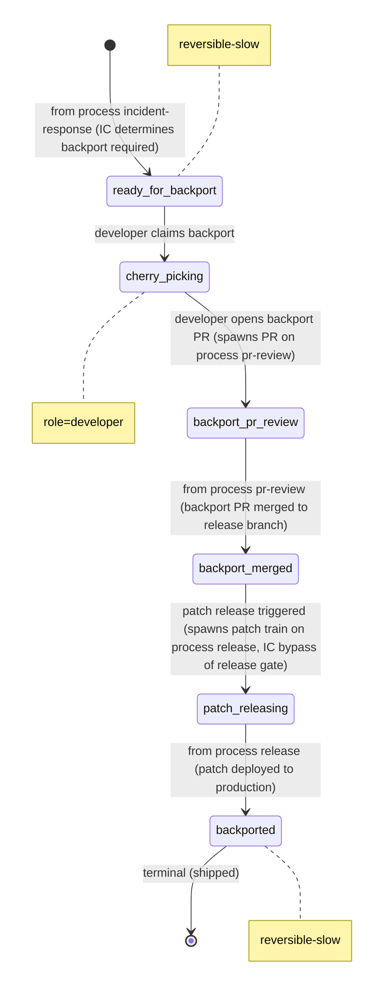

# Process: backport

> Defined in: `backport-states.json`

## State diagram

## States

| Name | Class | Reversibility | Roles | Issue types | Terminal taxonomy | Close reason |
|---|---|---|---|---|---|---|
| `ready_for_backport` | resting | reversible-slow | — | — | — | — |
| `cherry_picking` | working | — | developer | — | — | — |
| `backport_pr_review` | resting | — | — | — | — | — |
| `backport_merged` | resting | — | — | — | — | — |
| `patch_releasing` | resting | — | — | — | — | — |
| `backported` | terminal | reversible-slow | — | — | shipped | completed |

## Transitions

| From | To | Type | Label | Gate | HITL level |
|---|---|---|---|---|---|
| `[*]` | `ready_for_backport` | cross_process | 'from process incident-response (IC determines backport required)' | — | — |
| `ready_for_backport` | `cherry_picking` | claim | 'developer claims backport' | — | — |
| `cherry_picking` | `backport_pr_review` | role_action | 'developer opens backport PR (spawns PR on process pr-review)' | — | — |
| `backport_pr_review` | `backport_merged` | external | 'from process pr-review (backport PR merged to release branch)' | — | — |
| `backport_merged` | `patch_releasing` | external | 'patch release triggered (spawns patch train on process release, IC bypass of release gate)' | — | — |
| `patch_releasing` | `backported` | external | 'from process release (patch deployed to production)' | — | — |

## Cross-process handoffs

**Entries** (issues arriving from other processes):

- `ready_for_backport` ← process `incident-response` (spawn) — `from process incident-response (IC determines backport required)`
