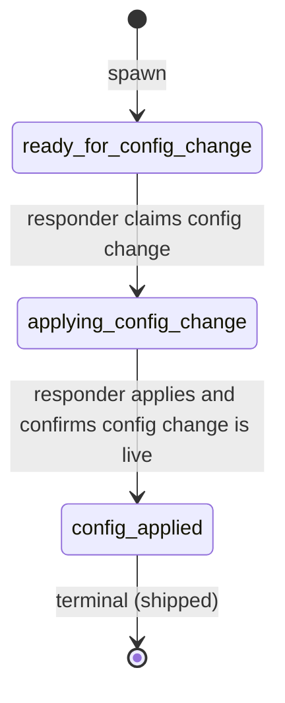

# Process: config-change

Apply a configuration change as an incident mitigation: feature-flag toggle, kill switch, runtime config value, rate-limit adjustment. Linear claim/advance flow — spawned from `mitigation.execute_mitigation`, closes at `config_applied` to release the parent. Out of scope: schema changes that require migrations (use `data-change`).

> Defined in: `config-change-states.json`

## Issue types accepted

- `config-change` — **Config change**: A runtime configuration change applied as part of an incident mitigation: feature-flag toggle, kill switch, config-value tweak, rate-limit adjustment. No code change, no PR. Tied to the parent incident-mitigation via `parent-of:<incident-mitigation>`. Closes at `config_applied`, cascading the parent mitigation toward `mitigated`.

## State diagram

## States

| Name | Class | Reversibility | Roles | Issue types | Human inputs | Terminal taxonomy | Close reason |
|---|---|---|---|---|---|---|---|
| `ready_for_config_change` | resting | reversible-fast | — | config-change | — | — | — |
| `applying_config_change` | working | — | incident-responder | config-change | clarify-scope, needs-security-review, blocked-on-data, general | — | — |
| `config_applied` | terminal | reversible-fast | — | — | — | shipped | completed |

## Transitions

| From | To | Type | Label | Gate | HITL level |
|---|---|---|---|---|---|
| `ready_for_config_change` | `applying_config_change` | claim | 'responder claims config change' | — | — |
| `applying_config_change` | `config_applied` | advance | 'responder applies and confirms config change is live' | — | — |
