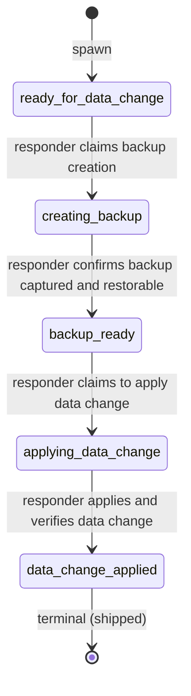

# Process: data-change

Apply a data change as an incident mitigation: corruption repair, manual update, backfill, replay. Backup is mandatory before any mutation — the process serializes `creating_backup` → `backup_ready` → `applying_data_change` so the responder cannot skip the safety net. Spawned from `mitigation.execute_mitigation`, closes at `data_change_applied` to release the parent.

> Defined in: `data-change-states.json`

## Issue types accepted

- `data-change` — **Data change**: A data mutation applied as part of an incident mitigation: corruption repair, manual update, backfill, event replay. Always preceded by a backup step (`creating_backup` → `backup_ready`) — the workflow enforces the safety net. Tied to the parent incident-mitigation via `parent-of:<incident-mitigation>`. Closes at `data_change_applied`, cascading the parent mitigation toward `mitigated`.

## State diagram

## States

| Name | Class | Reversibility | Roles | Issue types | Human inputs | Terminal taxonomy | Close reason |
|---|---|---|---|---|---|---|---|
| `ready_for_data_change` | resting | reversible-fast | — | data-change | — | — | — |
| `creating_backup` | working | — | incident-responder | data-change | blocked-on-data, general | — | — |
| `backup_ready` | resting | reversible-slow | — | data-change | — | — | — |
| `applying_data_change` | working | — | incident-responder | data-change | clarify-scope, needs-security-review, blocked-on-data, general | — | — |
| `data_change_applied` | terminal | reversible-slow | — | — | — | shipped | completed |

## Transitions

| From | To | Type | Label | Gate | HITL level |
|---|---|---|---|---|---|
| `ready_for_data_change` | `creating_backup` | claim | 'responder claims backup creation' | — | — |
| `creating_backup` | `backup_ready` | advance | 'responder confirms backup captured and restorable' | — | — |
| `backup_ready` | `applying_data_change` | claim | 'responder claims to apply data change' | — | — |
| `applying_data_change` | `data_change_applied` | advance | 'responder applies and verifies data change' | — | — |
