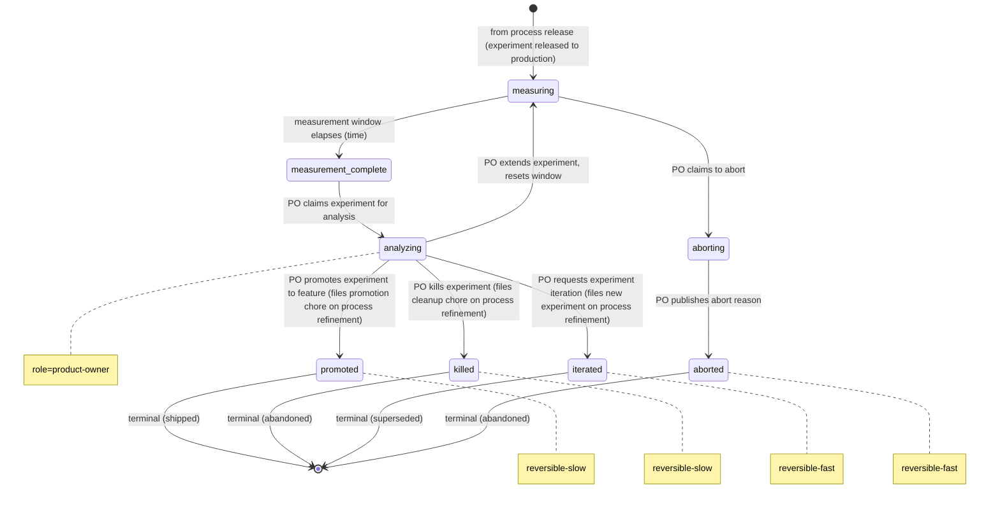

# Process: experimentation

> Defined in: `experimentation-states.json`

## Issue types accepted

- `experiment` — **Experiment**: Flag-gated feature shipped to a cohort for measurement. Branch prefix `exp/`. Requires hypothesis, metric, and cohort up-front. Post-merge owned by product-owner; closes at verdict on the experimentation lifecycle.

## State diagram

## States

| Name | Class | Reversibility | Roles | Issue types | Terminal taxonomy | Close reason |
|---|---|---|---|---|---|---|
| `measuring` | resting | — | — | — | — | — |
| `measurement_complete` | resting | — | — | — | — | — |
| `analyzing` | working | — | product-owner | — | — | — |
| `aborting` | working | — | — | — | — | — |
| `promoted` | terminal | reversible-slow | — | — | shipped | completed |
| `killed` | terminal | reversible-slow | — | — | abandoned | not planned |
| `iterated` | terminal | reversible-fast | — | — | superseded | not planned |
| `aborted` | terminal | reversible-fast | — | — | abandoned | not planned |

## Transitions

| From | To | Type | Label | Gate | HITL level |
|---|---|---|---|---|---|
| `[*]` | `measuring` | cross_process | 'from process release (experiment released to production)' | — | — |
| `measuring` | `measurement_complete` | external | 'measurement window elapses (time)' | — | — |
| `measuring` | `aborting` | claim | 'PO claims to abort' | — | — |
| `aborting` | `aborted` | role_action | 'PO publishes abort reason' | — | — |
| `measurement_complete` | `analyzing` | claim | 'PO claims experiment for analysis' | — | — |
| `analyzing` | `measuring` | role_action | 'PO extends experiment, resets window' | — | — |
| `analyzing` | `promoted` | role_action | 'PO promotes experiment to feature (files promotion chore on process refinement)' | — | — |
| `analyzing` | `killed` | role_action | 'PO kills experiment (files cleanup chore on process refinement)' | — | — |
| `analyzing` | `iterated` | role_action | 'PO requests experiment iteration (files new experiment on process refinement)' | — | — |

## Cross-process handoffs

**Entries** (issues arriving from other processes):

- `measuring` ← process `release` (spawn) — `from process release (experiment released to production)`
