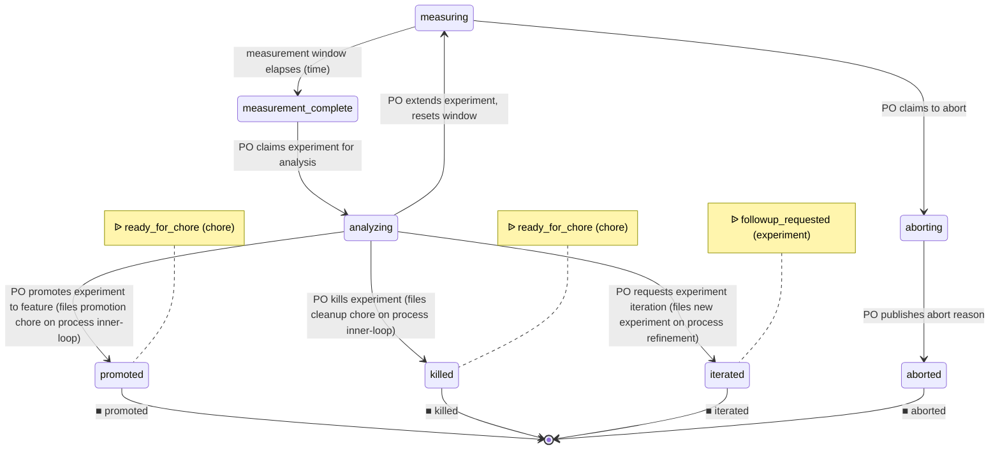

# Process: experimentation

Measure a flag-gated experiment in production and reach a verdict — ship-to-all, kill, or iterate. Owned by the product owner once the dev work is merged. Entry is `measuring`, a shared handoff with `release` — when an experiment-typed contributor lands in a release that ships, `release.cut.collects.advance_on` cascades it here per the `experiment → measuring` per-type rule.

> Defined in: `experimentation-states.json`

## Issue types accepted

- `experiment` — **Experiment**: Flag-gated feature shipped to a cohort for measurement. Branch prefix `exp/`. Requires hypothesis, metric, and cohort up-front. Post-merge owned by product-owner; closes at verdict on the experimentation lifecycle.

## State diagram

## States

| Name | Class | Reversibility | Roles | Issue types | Human inputs | Closure taxonomy | Close reason |
|---|---|---|---|---|---|---|---|
| `measuring` | resting | reversible-slow | — | experiment | — | — | — |
| `measurement_complete` | resting | reversible-fast | — | experiment | — | — | — |
| `analyzing` | working | — | product-owner | experiment | blocked-on-data, needs-ux-input, general | — | — |
| `aborting` | working | — | product-owner | experiment | general | — | — |
| `promoted` | resting | reversible-slow | — | — | — | shipped | completed |
| `killed` | resting | reversible-slow | — | — | — | abandoned | not planned |
| `iterated` | resting | reversible-fast | — | — | — | superseded | not planned |
| `aborted` | resting | reversible-fast | — | — | — | abandoned | not planned |

## Transitions

| From | To | Type | Label | Gate | HITL level |
|---|---|---|---|---|---|
| `measuring` | `measurement_complete` | event | 'measurement window elapses (time)' | — | — |
| `measuring` | `aborting` | claim | 'PO claims to abort' | — | — |
| `aborting` | `aborted` | advance | 'PO publishes abort reason' | — | — |
| `measurement_complete` | `analyzing` | claim | 'PO claims experiment for analysis' | — | — |
| `analyzing` | `measuring` | advance | 'PO extends experiment, resets window' | — | — |
| `analyzing` | `promoted` | advance | 'PO promotes experiment to feature (files promotion chore on process inner-loop)' | — | — |
| `analyzing` | `killed` | advance | 'PO kills experiment (files cleanup chore on process inner-loop)' | — | — |
| `analyzing` | `iterated` | advance | 'PO requests experiment iteration (files new experiment on process refinement)' | — | — |

## Cross-process interfaces

### Inbound

| State | Kind | From | Detail |
|---|---|---|---|
| `measuring` | ⊙ handoff | partner process(es) | shared resting state (also outbound) |

### Outbound

| State | Kind | To | Detail |
|---|---|---|---|
| `promoted` | ᐉ spawn | [`inner-loop`](./inner-loop.md) · `ready_for_chore` | as `chore` issue (independent) |
| `killed` | ᐉ spawn | [`inner-loop`](./inner-loop.md) · `ready_for_chore` | as `chore` issue (independent) |
| `iterated` | ᐉ spawn | _(derived)_ · `followup_requested` | as `experiment` issue (independent) |
| `measuring` | ⊙ handoff | partner process(es) | shared resting state (also inbound) |
| `aborted` | ■ exit | — (closes) | abandoned; closes `not planned` |
