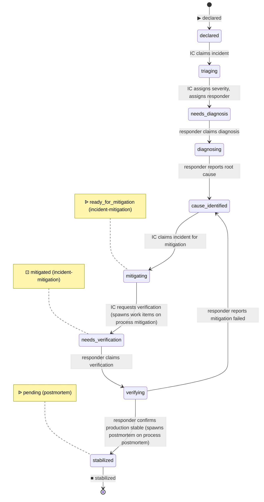

# Process: incident-response

Coordinate the live response to a production incident: declare, mitigate, stabilize. Spawns a postmortem on stabilization.

> Defined in: `incident-response-states.json`

## Issue types accepted

- `incident` — **Incident**: Live production incident. Opened by the IC at declaration; runs through incident-response to stabilization. Mitigation work is spawned as separate `incident-mitigation` tickets. Closes at `stabilized`; the postmortem is a separate spawned ticket.

## State diagram

## States

| Name | Class | Reversibility | Roles | Issue types | Human inputs | Closure taxonomy | Close reason |
|---|---|---|---|---|---|---|---|
| `declared` | resting | reversible-fast | — | incident | — | — | — |
| `triaging` | working | — | incident-commander | incident | blocked-on-data, general | — | — |
| `needs_diagnosis` | resting | reversible-fast | — | incident | — | — | — |
| `diagnosing` | working | — | incident-responder | incident | needs-arch-review, needs-security-review, blocked-on-data, general | — | — |
| `cause_identified` | resting | reversible-fast | — | incident | — | — | — |
| `mitigating` | working | — | incident-commander | incident | clarify-scope, needs-arch-review, needs-security-review, blocked-on-data, general | — | — |
| `needs_verification` | resting | reversible-fast | — | incident | — | — | — |
| `verifying` | working | — | incident-responder | incident | blocked-on-data, general | — | — |
| `stabilized` | resting | reversible-fast | — | — | — | superseded | completed |

## Transitions

| From | To | Type | Label | Gate | HITL level |
|---|---|---|---|---|---|
| `declared` | `triaging` | claim | 'IC claims incident' | — | — |
| `triaging` | `needs_diagnosis` | advance | 'IC assigns severity, assigns responder' | — | — |
| `needs_diagnosis` | `diagnosing` | claim | 'responder claims diagnosis' | — | — |
| `diagnosing` | `cause_identified` | advance | 'responder reports root cause' | — | — |
| `cause_identified` | `mitigating` | claim | 'IC claims incident for mitigation' | — | — |
| `mitigating` | `needs_verification` | advance | 'IC requests verification (spawns work items on process mitigation)' | — | — |
| `needs_verification` | `verifying` | claim | 'responder claims verification' | — | — |
| `verifying` | `cause_identified` | advance | 'responder reports mitigation failed' | — | — |
| `verifying` | `stabilized` | advance | 'responder confirms production stable (spawns postmortem on process postmortem)' | — | — |

## Cross-process interfaces

### Inbound

| State | Kind | From | Detail |
|---|---|---|---|
| `declared` | ▶ entry | — (external) | `create-issue --to declared` — alert / report triggers incident (external) |
| `needs_verification` | ⊡ feedback | [`mitigation`](./mitigation.md) · `mitigated` | child terminates → advance (spawned from `mitigating`, `incident-mitigation`) |

### Outbound

| State | Kind | To | Detail |
|---|---|---|---|
| `mitigating` | ᐉ spawn | [`mitigation`](./mitigation.md) · `ready_for_mitigation` | as `incident-mitigation` issue (subprocess) |
| `stabilized` | ᐉ spawn | [`postmortem`](./postmortem.md) · `pending` | as `postmortem` issue (independent) |
