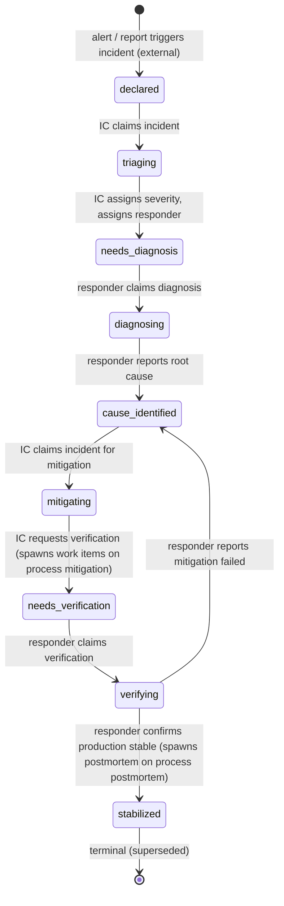

# Process: incident-response

Coordinate the live response to a production incident: declare, mitigate, stabilize. Spawns a postmortem on stabilization.

> Defined in: `incident-response-states.json`

## Issue types accepted

- `incident` — **Incident**: Live production incident. Opened by the IC at declaration; carries through incident-response from declaration to stabilization. Mitigation work is spawned as separate `incident`-typed tickets on the mitigation process — the IC stays on the parent in `mitigating` until a mitigation child returns. Closes at `stabilized`; postmortem is another separate (spawned) ticket.

## External entry points

States where new issues materialize from outside the workflow — manual `create-issue --to <state>`, a webhook, or a scheduled job. Distinct from spawn / collect targets, which are reached via upstream work in another process; the framework enforces the two as mutually exclusive per state.

- `declared` — alert / report triggers incident (external)

## State diagram

## States

| Name | Class | Reversibility | Roles | Issue types | Human inputs | Terminal taxonomy | Close reason |
|---|---|---|---|---|---|---|---|
| `declared` | resting | reversible-fast | — | — | — | — | — |
| `triaging` | working | — | incident-commander | incident | — | — | — |
| `needs_diagnosis` | resting | reversible-fast | — | — | — | — | — |
| `diagnosing` | working | — | incident-responder | incident | blocked-on-data, general | — | — |
| `cause_identified` | resting | reversible-fast | — | — | — | — | — |
| `mitigating` | working | — | incident-commander | incident | needs-security-review, blocked-on-data, general | — | — |
| `needs_verification` | resting | reversible-fast | — | — | — | — | — |
| `verifying` | working | — | incident-responder | incident | — | — | — |
| `stabilized` | terminal | reversible-fast | — | — | — | superseded | completed |

## Transitions

| From | To | Type | Label | Gate | HITL level |
|---|---|---|---|---|---|
| `declared` | `triaging` | claim | 'IC claims incident' | — | — |
| `triaging` | `needs_diagnosis` | advance | 'IC assigns severity, assigns responder' | — | — |
| `needs_diagnosis` | `diagnosing` | claim | 'responder claims diagnosis' | — | — |
| `diagnosing` | `cause_identified` | advance | 'responder reports root cause' | — | — |
| `cause_identified` | `mitigating` | claim | 'IC claims incident for mitigation' | — | — |
| `mitigating` | `needs_verification` | advance | 'IC requests verification (spawns work items on process mitigation)' | — | — |
| `needs_verification` | `verifying` | claim | 'responder claims verification' | — | — |
| `verifying` | `cause_identified` | advance | 'responder reports mitigation failed' | — | — |
| `verifying` | `stabilized` | advance | 'responder confirms production stable (spawns postmortem on process postmortem)' | — | — |

## Cross-process handoffs

**Spawns** (states that create child issues on other processes):

- `mitigating` (subprocess) → process `mitigation` as `incident` issue at `ready_for_mitigation`
    - on child `mitigated` → parent `needs_verification`
- `stabilized` (independent) → process `postmortem` as `postmortem` issue at `pending`
