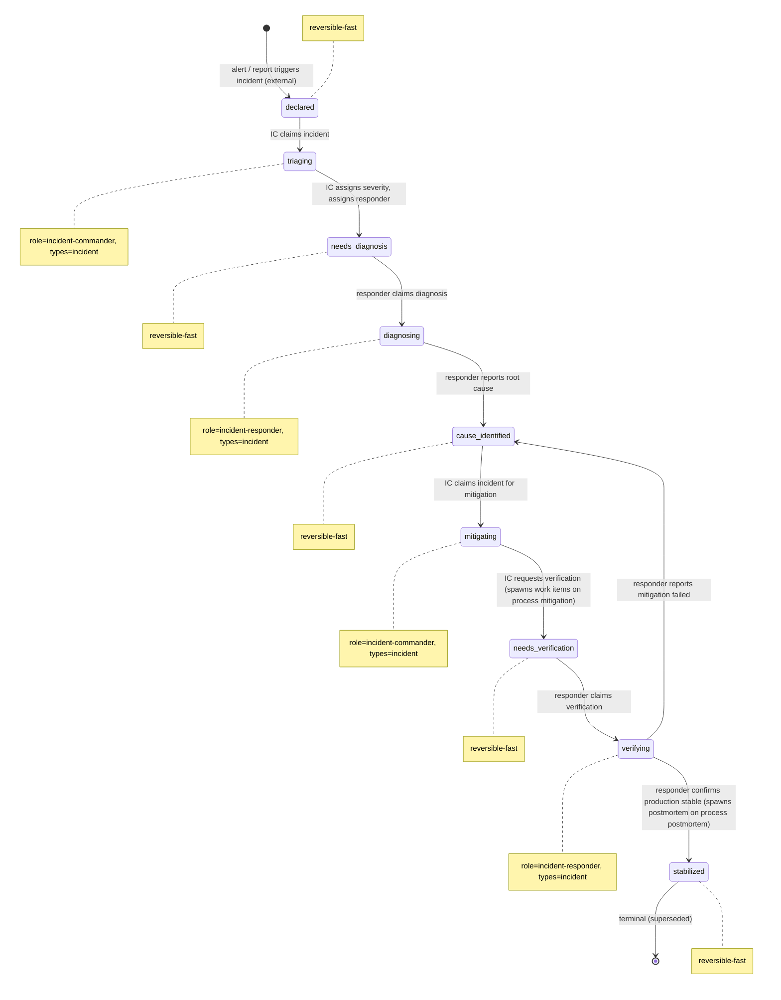

# Process: incident-response

> Defined in: `incident-response-states.json`

## Issue types accepted

- `incident` — **Incident**: Live production incident. Opened by the IC at declaration; carries through incident-response and any mitigation work on the same ticket. Closes at `stabilized`; postmortem is a separate (spawned) ticket.

## State diagram

## States

| Name | Class | Reversibility | Roles | Issue types | Terminal taxonomy | Close reason |
|---|---|---|---|---|---|---|
| `declared` | resting | reversible-fast | — | — | — | — |
| `triaging` | working | — | incident-commander | incident | — | — |
| `needs_diagnosis` | resting | reversible-fast | — | — | — | — |
| `diagnosing` | working | — | incident-responder | incident | — | — |
| `cause_identified` | resting | reversible-fast | — | — | — | — |
| `mitigating` | working | — | incident-commander | incident | — | — |
| `needs_verification` | resting | reversible-fast | — | — | — | — |
| `verifying` | working | — | incident-responder | incident | — | — |
| `stabilized` | terminal | reversible-fast | — | — | superseded | completed |

## Transitions

| From | To | Type | Label | Gate | HITL level |
|---|---|---|---|---|---|
| `[*]` | `declared` | external | 'alert / report triggers incident (external)' | — | — |
| `declared` | `triaging` | claim | 'IC claims incident' | — | — |
| `triaging` | `needs_diagnosis` | role_action | 'IC assigns severity, assigns responder' | — | — |
| `needs_diagnosis` | `diagnosing` | claim | 'responder claims diagnosis' | — | — |
| `diagnosing` | `cause_identified` | role_action | 'responder reports root cause' | — | — |
| `cause_identified` | `mitigating` | claim | 'IC claims incident for mitigation' | — | — |
| `mitigating` | `needs_verification` | role_action | 'IC requests verification (spawns work items on process mitigation)' | — | — |
| `needs_verification` | `verifying` | claim | 'responder claims verification' | — | — |
| `verifying` | `cause_identified` | role_action | 'responder reports mitigation failed' | — | — |
| `verifying` | `stabilized` | role_action | 'responder confirms production stable (spawns postmortem on process postmortem)' | — | — |
