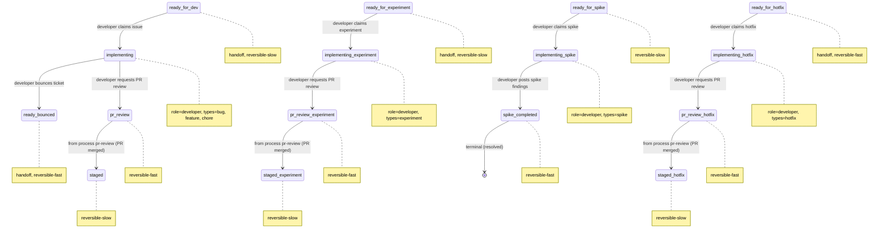

# Process: inner-loop

> Defined in: `inner-loop-states.json`

## Issue types accepted

- `bug` — **Bug**: Defect in shipped behavior — something is broken or wrong. Branch prefix `fix/`. Failing test first; reviewer scrutinizes root cause vs surface symptom.
- `chore` — **Chore**: Internal cleanup with no user-visible behavior change: refactors, dependency bumps, lint config. Branch prefix `chore/`. QA may be skipped at reviewer discretion.
- `experiment` — **Experiment**: Flag-gated feature shipped to a cohort for measurement. Branch prefix `exp/`. Requires hypothesis, metric, and cohort up-front. Post-merge owned by product-owner; closes at verdict on the experimentation lifecycle.
- `feature` — **Feature**: New user-facing capability or enhancement to existing behavior. Branch prefix `feat/`. Standard inner-loop flow with no per-step variations.
- `hotfix` — **Hotfix**: Compressed inner-loop work for urgent production fixes during active incidents. Branch prefix `hotfix/`. Spawned by mitigation under IC authority; skips refinement; QA may be bypassed.
- `spike` — **Spike**: Time-boxed investigation. Branch prefix `spike/`. Deliverable is a findings doc, not merged code — the PR is never merged. Follow-ups re-enter refinement.

## State diagram

## States

| Name | Class | Reversibility | Roles | Issue types | Input topics | Terminal taxonomy | Close reason |
|---|---|---|---|---|---|---|---|
| `ready_for_dev` | resting | reversible-slow | — | — | — | — | — |
| `ready_for_experiment` | resting | reversible-slow | — | — | — | — | — |
| `ready_for_spike` | resting | reversible-slow | — | — | — | — | — |
| `ready_for_hotfix` | resting | reversible-fast | — | — | — | — | — |
| `implementing` | working | — | developer | bug, feature, chore | clarify-scope, needs-arch-review, needs-security-review, blocked-on-data, general | — | — |
| `implementing_experiment` | working | — | developer | experiment | clarify-scope, needs-arch-review, general | — | — |
| `implementing_spike` | working | — | developer | spike | clarify-scope, needs-arch-review, general | — | — |
| `implementing_hotfix` | working | — | developer | hotfix | needs-security-review, blocked-on-data, general | — | — |
| `pr_review` | resting | reversible-fast | — | — | — | — | — |
| `pr_review_experiment` | resting | reversible-fast | — | — | — | — | — |
| `pr_review_hotfix` | resting | reversible-fast | — | — | — | — | — |
| `staged` | resting | reversible-slow | — | — | — | — | — |
| `staged_experiment` | resting | reversible-slow | — | — | — | — | — |
| `staged_hotfix` | resting | reversible-slow | — | — | — | — | — |
| `spike_completed` | terminal | reversible-fast | — | — | — | resolved | completed |
| `ready_bounced` | resting | reversible-fast | — | — | — | — | — |

## Transitions

| From | To | Type | Label | Gate | HITL level |
|---|---|---|---|---|---|
| `ready_for_dev` | `implementing` | claim | 'developer claims issue' | — | — |
| `ready_for_experiment` | `implementing_experiment` | claim | 'developer claims experiment' | — | — |
| `ready_for_spike` | `implementing_spike` | claim | 'developer claims spike' | — | — |
| `ready_for_hotfix` | `implementing_hotfix` | claim | 'developer claims hotfix' | — | — |
| `implementing` | `ready_bounced` | advance | 'developer bounces ticket' | — | — |
| `implementing` | `pr_review` | advance | 'developer requests PR review' | — | — |
| `implementing_experiment` | `pr_review_experiment` | advance | 'developer requests PR review' | — | — |
| `implementing_hotfix` | `pr_review_hotfix` | advance | 'developer requests PR review' | — | — |
| `implementing_spike` | `spike_completed` | advance | 'developer posts spike findings' | — | — |
| `pr_review` | `staged` | event | 'from process pr-review (PR merged)' | — | — |
| `pr_review_experiment` | `staged_experiment` | event | 'from process pr-review (PR merged)' | — | — |
| `pr_review_hotfix` | `staged_hotfix` | event | 'from process pr-review (PR merged)' | — | — |

## Cross-process handoffs

**Handoff states** (shared resting states declared in ≥2 processes):

- `ready_for_dev` — interface state, also declared by the partner process(es).
- `ready_for_experiment` — interface state, also declared by the partner process(es).
- `ready_for_hotfix` — interface state, also declared by the partner process(es).
- `ready_bounced` — interface state, also declared by the partner process(es).

**Spawns** (states that create child issues on other processes):

- `implementing` (subprocess) → process `pr` as `pr` issue at `draft`
    - on child `staged` → parent `staged`
- `implementing_experiment` (subprocess) → process `pr` as `pr` issue at `draft`
    - on child `staged` → parent `staged_experiment`
- `implementing_hotfix` (subprocess) → process `pr` as `pr` issue at `draft`
    - on child `staged` → parent `staged_hotfix`
