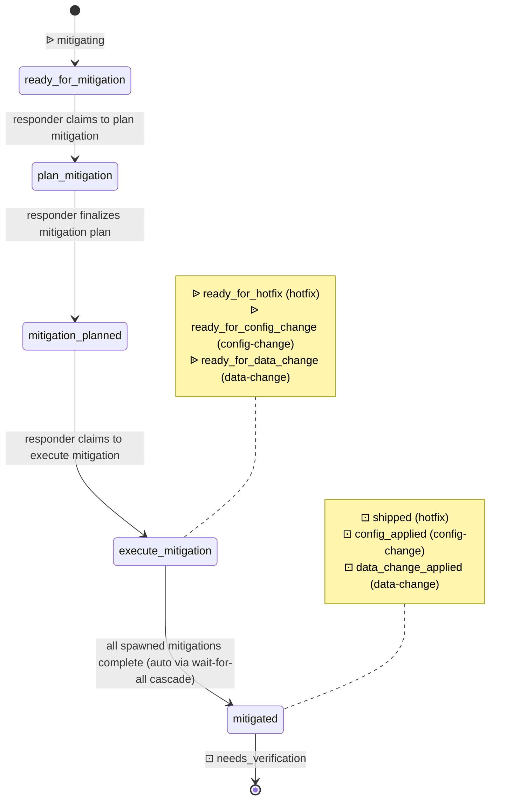

# Process: mitigation

Plan and execute a mitigation strategy during an active incident. The responder drafts a plan, then dispatches one or more sub-mitigations — a hotfix, a configuration change, a data change, or any combination — each as a child issue on its own process. `execute_mitigation` declares a multi-spawn rule per mitigation type; the wait-for-all cascade closes this issue at `mitigated` only when every spawned child reaches its respective applied / shipped closing state, which in turn cascades the parent incident to `needs_verification`.

> Defined in: `mitigation-states.json`

## Issue types accepted

- `incident-mitigation` — **Incident mitigation**: A mitigation work item spawned from an incident. The responder drafts a plan in `plan_mitigation` and then in `execute_mitigation` dispatches one or more sub-mitigations (any combination of `hotfix`, `config-change`, `data-change`) as child issues on their respective processes. Tied to the parent incident via `parent-of:<incident>`. Closes at `mitigated` only when every spawned child reaches its applied / shipped closing state — wait-for-all — at which point the parent incident cascades to `needs_verification`.

## State diagram

## States

| Name | Class | Reversibility | Roles | Issue types | Human inputs | Closure taxonomy | Close reason |
|---|---|---|---|---|---|---|---|
| `ready_for_mitigation` | resting | reversible-fast | — | incident-mitigation | — | — | — |
| `plan_mitigation` | working | — | incident-responder | incident-mitigation | clarify-scope, needs-arch-review, needs-security-review, blocked-on-data, general | — | — |
| `mitigation_planned` | resting | reversible-fast | — | incident-mitigation | — | — | — |
| `execute_mitigation` | working | — | incident-responder | incident-mitigation | clarify-scope, general | — | — |
| `mitigated` | resting | reversible-slow | — | — | — | shipped | completed |

## Transitions

| From | To | Type | Label | Gate | HITL level |
|---|---|---|---|---|---|
| `ready_for_mitigation` | `plan_mitigation` | claim | 'responder claims to plan mitigation' | — | — |
| `plan_mitigation` | `mitigation_planned` | advance | 'responder finalizes mitigation plan' | — | — |
| `mitigation_planned` | `execute_mitigation` | claim | 'responder claims to execute mitigation' | — | — |
| `execute_mitigation` | `mitigated` | advance | 'all spawned mitigations complete (auto via wait-for-all cascade)' | — | — |

## Cross-process interfaces

### Inbound

| State | Kind | From | Detail |
|---|---|---|---|
| `ready_for_mitigation` | ᐉ spawn | [`incident-response`](./incident-response.md) · `mitigating` | `incident-mitigation` issue |
| `mitigated` | ⊡ feedback | _(derived)_ · `shipped` | child terminates → advance (spawned from `execute_mitigation`, `hotfix`) |
| `mitigated` | ⊡ feedback | _(derived)_ · `config_applied` | child terminates → advance (spawned from `execute_mitigation`, `config-change`) |
| `mitigated` | ⊡ feedback | _(derived)_ · `data_change_applied` | child terminates → advance (spawned from `execute_mitigation`, `data-change`) |

### Outbound

| State | Kind | To | Detail |
|---|---|---|---|
| `mitigated` | ⊡ feedback | [`incident-response`](./incident-response.md) | advances parent to `needs_verification` (spawn from `mitigating`, `incident-mitigation`) |
| `execute_mitigation` | ᐉ spawn | _(derived)_ · `ready_for_hotfix` | as `hotfix` issue (subprocess) |
| `execute_mitigation` | ᐉ spawn | _(derived)_ · `ready_for_config_change` | as `config-change` issue (subprocess) |
| `execute_mitigation` | ᐉ spawn | _(derived)_ · `ready_for_data_change` | as `data-change` issue (subprocess) |
