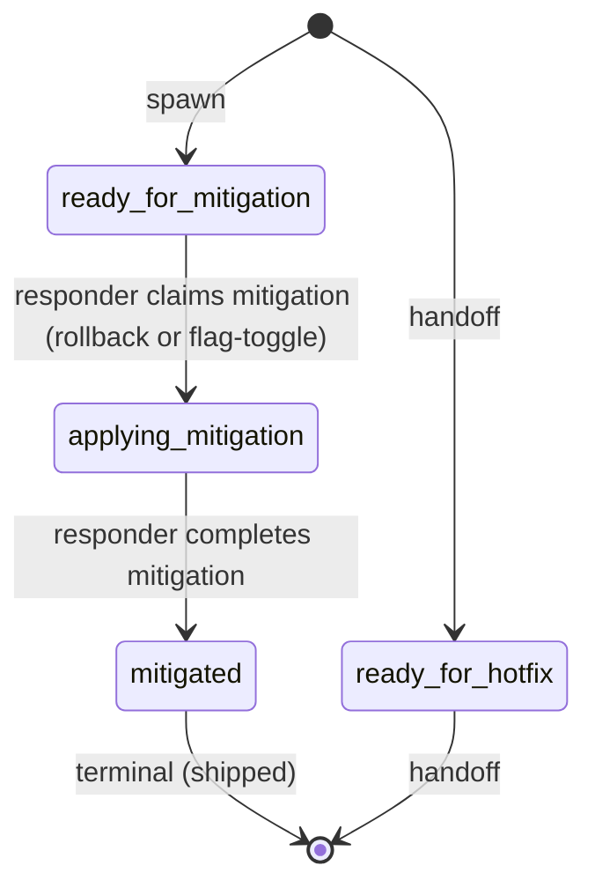

# Process: mitigation

Roll back or feature-flag-off shipped behavior to stop bleeding during an active incident. Branches off incident-response when a revert is the right call.

> Defined in: `mitigation-states.json`

## Issue types accepted

- `incident` — **Incident**: Live production incident. Opened by the IC at declaration; carries through incident-response from declaration to stabilization. Mitigation work is spawned as separate `incident`-typed tickets on the mitigation process — the IC stays on the parent in `mitigating` until a mitigation child returns. Closes at `stabilized`; postmortem is another separate (spawned) ticket.

## State diagram

## States

| Name | Class | Reversibility | Roles | Issue types | Human inputs | Terminal taxonomy | Close reason |
|---|---|---|---|---|---|---|---|
| `ready_for_mitigation` | resting | reversible-fast | — | — | — | — | — |
| `ready_for_hotfix` | resting | reversible-fast | — | — | — | — | — |
| `applying_mitigation` | working | — | incident-responder | incident | — | — | — |
| `mitigated` | terminal | reversible-slow | — | — | — | shipped | completed |

## Transitions

| From | To | Type | Label | Gate | HITL level |
|---|---|---|---|---|---|
| `ready_for_mitigation` | `applying_mitigation` | claim | 'responder claims mitigation (rollback or flag-toggle)' | — | — |
| `applying_mitigation` | `mitigated` | advance | 'responder completes mitigation' | — | — |

## Cross-process handoffs

**Handoff states** (shared resting states declared in ≥2 processes):

- `ready_for_hotfix` — interface state, also declared by the partner process(es).
