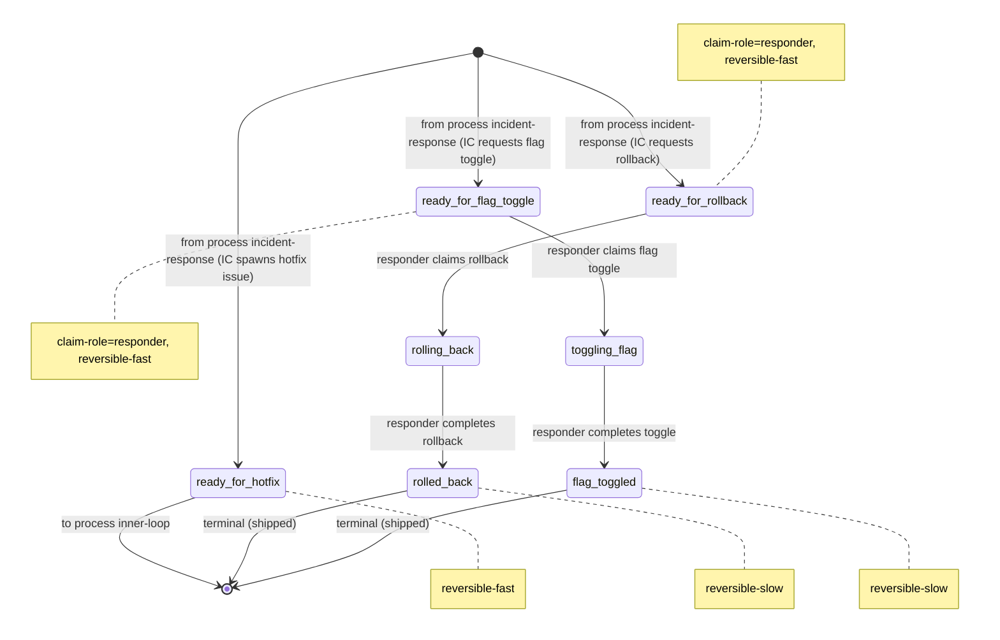

# Process: mitigation

> Defined in: `mitigation-states.json`

## State diagram

## States

| Name | Class | Reversibility | Claim role | Terminal taxonomy | Close reason |
|---|---|---|---|---|---|
| `ready_for_rollback` | resting | reversible-fast | responder | — | — |
| `ready_for_flag_toggle` | resting | reversible-fast | responder | — | — |
| `ready_for_hotfix` | resting | reversible-fast | — | — | — |
| `rolling_back` | working | — | — | — | — |
| `rolled_back` | terminal | reversible-slow | — | shipped | completed |
| `toggling_flag` | working | — | — | — | — |
| `flag_toggled` | terminal | reversible-slow | — | shipped | completed |

## Transitions

| From | To | Type | Label | Gate | HITL level |
|---|---|---|---|---|---|
| `[*]` | `ready_for_rollback` | cross_process | 'from process incident-response (IC requests rollback)' | — | — |
| `[*]` | `ready_for_flag_toggle` | cross_process | 'from process incident-response (IC requests flag toggle)' | — | — |
| `[*]` | `ready_for_hotfix` | cross_process | 'from process incident-response (IC spawns hotfix issue)' | — | — |
| `ready_for_rollback` | `rolling_back` | claim | 'responder claims rollback' | — | — |
| `rolling_back` | `rolled_back` | role_action | 'responder completes rollback' | — | — |
| `ready_for_flag_toggle` | `toggling_flag` | claim | 'responder claims flag toggle' | — | — |
| `toggling_flag` | `flag_toggled` | role_action | 'responder completes toggle' | — | — |
| `ready_for_hotfix` | `[*]` | cross_process | 'to process inner-loop' | — | — |

## Cross-process handoffs

**Entries** (issues arriving from other processes):

- `ready_for_rollback` ← process `incident-response` (spawn) — `from process incident-response (IC requests rollback)`
- `ready_for_flag_toggle` ← process `incident-response` (spawn) — `from process incident-response (IC requests flag toggle)`
- `ready_for_hotfix` ← process `incident-response` (spawn) — `from process incident-response (IC spawns hotfix issue)`

**Exits** (issues handed to other processes):

- `ready_for_hotfix` → process `inner-loop` (shared) — `to process inner-loop`
