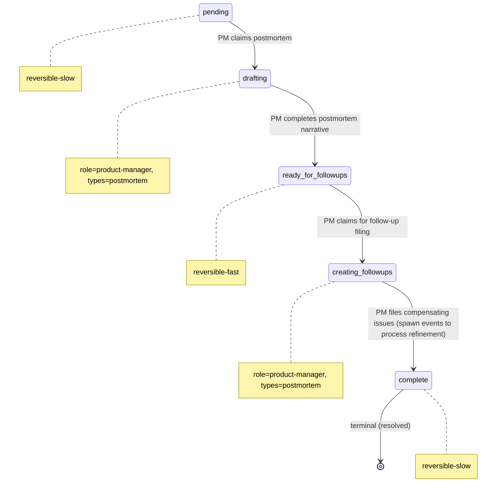

# Process: postmortem

> Defined in: `postmortem-states.json`

## Issue types accepted

- `postmortem` — **Postmortem**: Post-incident review work. Spawned at `incident.stabilized`; owns the narrative, root-cause integration, and follow-up filing. Distinct ticket from the incident itself so the postmortem can outlive the incident's close.

## State diagram

## States

| Name | Class | Reversibility | Roles | Issue types | Input topics | Terminal taxonomy | Close reason |
|---|---|---|---|---|---|---|---|
| `pending` | resting | reversible-slow | — | — | — | — | — |
| `drafting` | working | — | product-manager | postmortem | — | — | — |
| `ready_for_followups` | resting | reversible-fast | — | — | — | — | — |
| `creating_followups` | working | — | product-manager | postmortem | — | — | — |
| `complete` | terminal | reversible-slow | — | — | — | resolved | completed |

## Transitions

| From | To | Type | Label | Gate | HITL level |
|---|---|---|---|---|---|
| `pending` | `drafting` | claim | 'PM claims postmortem' | — | — |
| `drafting` | `ready_for_followups` | advance | 'PM completes postmortem narrative' | — | — |
| `ready_for_followups` | `creating_followups` | claim | 'PM claims for follow-up filing' | — | — |
| `creating_followups` | `complete` | advance | 'PM files compensating issues (spawn events to process refinement)' | — | — |
