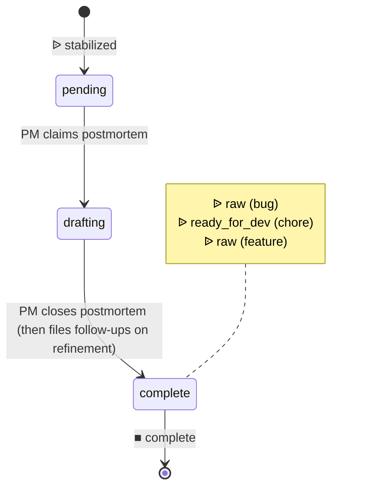

# Process: postmortem

Document the timeline, root cause, and remediation for an incident. Spawned by incident-response on stabilization; closes at `complete`. On close, the PM files follow-ups (bug/chore/feature) on refinement via the closing-state spawn declaration — `workflow spawn-issue --issue-type bug --initial-state raw` (etc.) for each item.

> Defined in: `postmortem-states.json`

## Issue types accepted

- `postmortem` — **Postmortem**: Post-incident review work. Spawned at `incident.stabilized`; owns the narrative, root-cause integration, and follow-up filing. Distinct ticket from the incident itself so the postmortem can outlive the incident's close.

## State diagram

## States

| Name | Class | Reversibility | Roles | Issue types | Human inputs | Closure taxonomy | Close reason |
|---|---|---|---|---|---|---|---|
| `pending` | resting | reversible-slow | — | postmortem | — | — | — |
| `drafting` | working | — | product-manager | postmortem | blocked-on-data, needs-security-review, general | — | — |
| `complete` | resting | reversible-slow | — | — | — | resolved | completed |

## Transitions

| From | To | Type | Label | Gate | HITL level |
|---|---|---|---|---|---|
| `pending` | `drafting` | claim | 'PM claims postmortem' | — | — |
| `drafting` | `complete` | advance | 'PM closes postmortem (then files follow-ups on refinement)' | — | — |

## Cross-process interfaces

### Inbound

| State | Kind | From | Detail |
|---|---|---|---|
| `pending` | ᐉ spawn | [`incident-response`](./incident-response.md) · `stabilized` | `postmortem` issue |

### Outbound

| State | Kind | To | Detail |
|---|---|---|---|
| `complete` | ᐉ spawn | _(derived)_ · `raw` | as `bug` issue (independent) |
| `complete` | ᐉ spawn | [`inner-loop`](./inner-loop.md) · `ready_for_dev` | as `chore` issue (independent) |
| `complete` | ᐉ spawn | _(derived)_ · `raw` | as `feature` issue (independent) |
