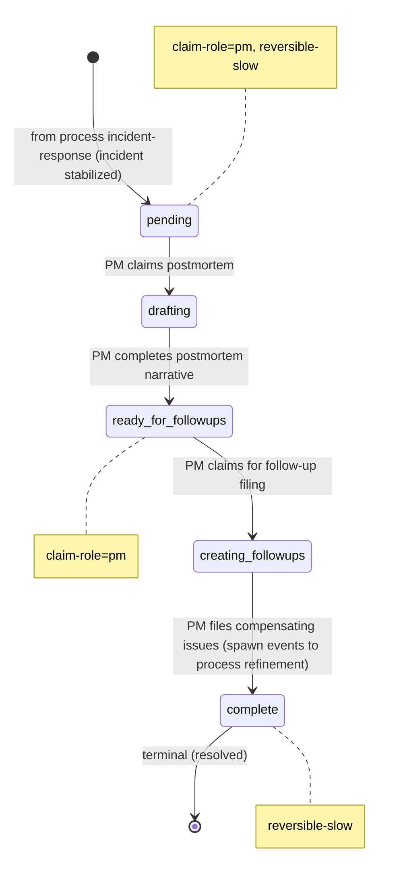

# Process: postmortem

> Defined in: `postmortem-states.json`

## State diagram

## States

| Name | Class | Reversibility | Claim role | Terminal taxonomy | Close reason |
|---|---|---|---|---|---|
| `pending` | resting | reversible-slow | pm | — | — |
| `drafting` | working | — | — | — | — |
| `ready_for_followups` | resting | — | pm | — | — |
| `creating_followups` | working | — | — | — | — |
| `complete` | terminal | reversible-slow | — | resolved | completed |

## Transitions

| From | To | Type | Label | Gate | HITL level |
|---|---|---|---|---|---|
| `[*]` | `pending` | cross_process | 'from process incident-response (incident stabilized)' | — | — |
| `pending` | `drafting` | claim | 'PM claims postmortem' | — | — |
| `drafting` | `ready_for_followups` | role_action | 'PM completes postmortem narrative' | — | — |
| `ready_for_followups` | `creating_followups` | claim | 'PM claims for follow-up filing' | — | — |
| `creating_followups` | `complete` | role_action | 'PM files compensating issues (spawn events to process refinement)' | — | — |

## Cross-process handoffs

**Entries** (issues arriving from other processes):

- `pending` ← process `incident-response` (spawn) — `from process incident-response (incident stabilized)`
