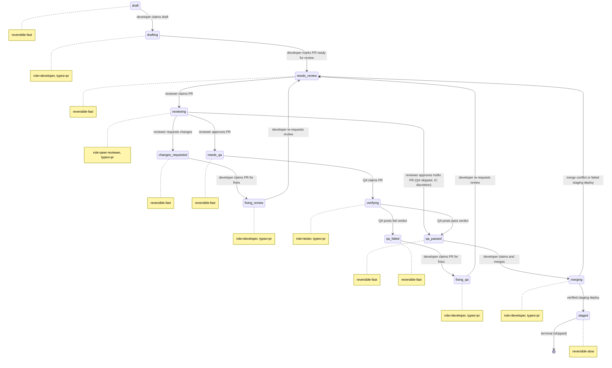

# Process: pr

> Defined in: `pr-states.json`

## Issue types accepted

- `pr` — **Pull Request**: A proposed code change. Spawned by a developer running `gh pr create` from inner-loop's implementing state. One ticket can spawn zero (spike findings doc), one (typical), or many PRs (incident mitigation chains, hotfix + backports, multi-component features). Not created via `workflow create`; the framework recognises it for cross-process modelling and documentation.

## State diagram

## States

| Name | Class | Reversibility | Roles | Issue types | Terminal taxonomy | Close reason |
|---|---|---|---|---|---|---|
| `draft` | resting | reversible-fast | — | — | — | — |
| `drafting` | working | — | developer | pr | — | — |
| `needs_review` | resting | reversible-fast | — | — | — | — |
| `reviewing` | working | — | peer-reviewer | pr | — | — |
| `changes_requested` | resting | reversible-fast | — | — | — | — |
| `fixing_review` | working | — | developer | pr | — | — |
| `needs_qa` | resting | reversible-fast | — | — | — | — |
| `verifying` | working | — | tester | pr | — | — |
| `qa_passed` | resting | reversible-fast | — | — | — | — |
| `qa_failed` | resting | reversible-fast | — | — | — | — |
| `fixing_qa` | working | — | developer | pr | — | — |
| `merging` | working | — | developer | pr | — | — |
| `staged` | terminal | reversible-slow | — | — | shipped | completed |

## Transitions

| From | To | Type | Label | Gate | HITL level |
|---|---|---|---|---|---|
| `draft` | `drafting` | claim | 'developer claims draft' | — | — |
| `drafting` | `needs_review` | advance | 'developer marks PR ready for review' | — | — |
| `needs_review` | `reviewing` | claim | 'reviewer claims PR' | — | — |
| `reviewing` | `needs_qa` | advance | 'reviewer approves PR' | — | — |
| `reviewing` | `qa_passed` | advance | 'reviewer approves hotfix PR (QA skipped, IC discretion)' | — | — |
| `reviewing` | `changes_requested` | advance | 'reviewer requests changes' | — | — |
| `changes_requested` | `fixing_review` | claim | 'developer claims PR for fixes' | — | — |
| `fixing_review` | `needs_review` | advance | 'developer re-requests review' | — | — |
| `needs_qa` | `verifying` | claim | 'QA claims PR' | — | — |
| `verifying` | `qa_passed` | advance | 'QA posts pass verdict' | — | — |
| `verifying` | `qa_failed` | advance | 'QA posts fail verdict' | — | — |
| `qa_failed` | `fixing_qa` | claim | 'developer claims PR for fixes' | — | — |
| `fixing_qa` | `needs_review` | advance | 'developer re-requests review' | — | — |
| `qa_passed` | `merging` | claim | 'developer claims and merges' | — | — |
| `merging` | `staged` | advance | 'verified staging deploy' | — | — |
| `merging` | `needs_review` | advance | 'merge conflict or failed staging deploy' | — | — |
