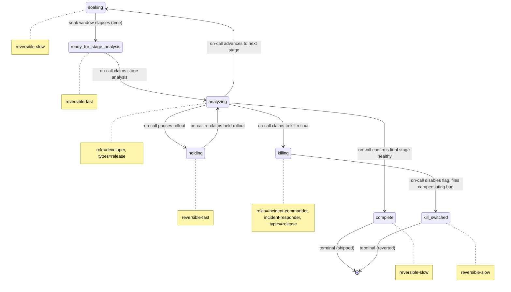

# Process: progressive-rollout

> Defined in: `progressive-rollout-states.json`

## Issue types accepted

- `release` — **Release**: A release-train work item. Tracks one cut through prep → deploy → monitor; experimentation and progressive-rollout are phases that operate on the same release ticket.

## State diagram

## States

| Name | Class | Reversibility | Roles | Issue types | Input topics | Terminal taxonomy | Close reason |
|---|---|---|---|---|---|---|---|
| `soaking` | resting | reversible-slow | — | — | — | — | — |
| `ready_for_stage_analysis` | resting | reversible-fast | — | — | — | — | — |
| `analyzing` | working | — | developer | release | — | — | — |
| `holding` | resting | reversible-fast | — | — | — | — | — |
| `killing` | working | — | incident-commander, incident-responder | release | — | — | — |
| `complete` | terminal | reversible-slow | — | — | — | shipped | completed |
| `kill_switched` | terminal | reversible-slow | — | — | — | reverted | completed |

## Transitions

| From | To | Type | Label | Gate | HITL level |
|---|---|---|---|---|---|
| `soaking` | `ready_for_stage_analysis` | event | 'soak window elapses (time)' | — | — |
| `ready_for_stage_analysis` | `analyzing` | claim | 'on-call claims stage analysis' | — | — |
| `analyzing` | `soaking` | advance | 'on-call advances to next stage' | — | — |
| `analyzing` | `complete` | advance | 'on-call confirms final stage healthy' | — | — |
| `analyzing` | `holding` | advance | 'on-call pauses rollout' | — | — |
| `analyzing` | `killing` | advance | 'on-call claims to kill rollout' | — | — |
| `holding` | `analyzing` | claim | 'on-call re-claims held rollout' | — | — |
| `killing` | `kill_switched` | advance | 'on-call disables flag, files compensating bug' | — | — |
