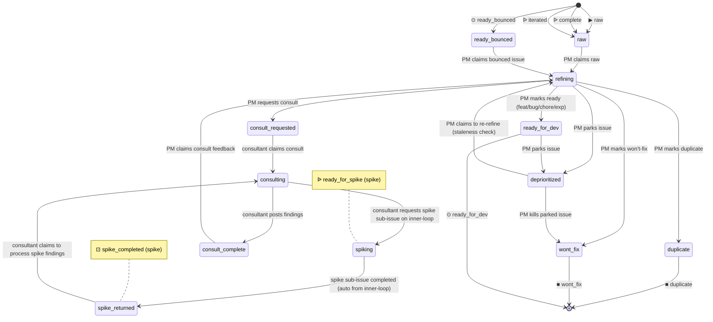

# Process: refinement

Shape raw ideas and bug reports into ready-for-dev tickets. The product manager owns the queue, classifies issue type, and either marks ready or parks/kills. Chores skip this process and are filed directly on `inner-loop.ready_for_dev` — engineering hygiene work doesn't need PM refinement.

> Defined in: `refinement-states.json`

## Issue types accepted

- `bug` — **Bug**: Defect in shipped behavior — something is broken or wrong. Branch prefix `fix/`. Failing test first; reviewer scrutinizes root cause vs surface symptom.
- `experiment` — **Experiment**: Flag-gated feature shipped to a cohort for measurement. Branch prefix `exp/`. Requires hypothesis, metric, and cohort up-front. Post-merge owned by product-owner; closes at verdict on the experimentation lifecycle.
- `feature` — **Feature**: New user-facing capability or enhancement to existing behavior. Branch prefix `feat/`. Standard inner-loop flow with no per-step variations.

## State diagram

## States

| Name | Class | Reversibility | Roles | Issue types | Human inputs | Terminal taxonomy | Close reason |
|---|---|---|---|---|---|---|---|
| `raw` | resting | reversible-fast | — | bug, feature, experiment | — | — | — |
| `refining` | working | — | product-manager | bug, feature, experiment | clarify-scope, needs-arch-review, needs-security-review, needs-ux-input, blocked-on-data, general | — | — |
| `consult_requested` | resting | reversible-fast | — | bug, feature, experiment | — | — | — |
| `consulting` | working | — | architect, designer, security-engineer | bug, feature, experiment | clarify-scope, needs-arch-review, needs-security-review, needs-ux-input, blocked-on-data, general | — | — |
| `consult_complete` | resting | reversible-fast | — | bug, feature, experiment | — | — | — |
| `spiking` | resting | reversible-fast | — | bug, feature, experiment | — | — | — |
| `spike_returned` | resting | reversible-fast | — | bug, feature, experiment | — | — | — |
| `ready_for_dev` | resting | reversible-slow | — | bug, feature, experiment | — | — | — |
| `ready_bounced` | resting | reversible-fast | — | bug, feature, experiment | — | — | — |
| `deprioritized` | resting | reversible-fast | — | bug, feature, experiment | — | — | — |
| `duplicate` | terminal | reversible-fast | — | — | — | deduplicated | not planned |
| `wont_fix` | terminal | reversible-fast | — | — | — | abandoned | not planned |

## Transitions

| From | To | Type | Label | Gate | HITL level |
|---|---|---|---|---|---|
| `raw` | `refining` | claim | 'PM claims raw' | — | — |
| `refining` | `duplicate` | advance | 'PM marks duplicate' | — | — |
| `refining` | `wont_fix` | advance | "PM marks won't-fix" | — | — |
| `refining` | `consult_requested` | advance | 'PM requests consult' | — | — |
| `consult_requested` | `consulting` | claim | 'consultant claims consult' | — | — |
| `consulting` | `consult_complete` | advance | 'consultant posts findings' | — | — |
| `consult_complete` | `refining` | claim | 'PM claims consult feedback' | — | — |
| `consulting` | `spiking` | advance | 'consultant requests spike sub-issue on inner-loop' | — | — |
| `spiking` | `spike_returned` | event | 'spike sub-issue completed (auto from inner-loop)' | — | — |
| `spike_returned` | `consulting` | claim | 'consultant claims to process spike findings' | — | — |
| `refining` | `ready_for_dev` | advance | 'PM marks ready (feat/bug/chore/exp)' | — | — |
| `ready_bounced` | `refining` | claim | 'PM claims bounced issue' | — | — |
| `refining` | `deprioritized` | advance | 'PM parks issue' | — | — |
| `ready_for_dev` | `deprioritized` | advance | 'PM parks issue' | — | — |
| `deprioritized` | `refining` | claim | 'PM claims to re-refine (staleness check)' | — | — |
| `deprioritized` | `wont_fix` | advance | 'PM kills parked issue' | — | — |

## Cross-process interfaces

### Inbound

| State | Kind | From | Detail |
|---|---|---|---|
| `raw` | ▶ entry | — (external) | `create-issue --to raw` — issue created (external) |
| `raw` | ᐉ spawn | [`experimentation`](./experimentation.md) · `iterated` | `experiment` issue |
| `raw` | ᐉ spawn | [`postmortem`](./postmortem.md) · `complete` | `bug` issue |
| `raw` | ᐉ spawn | [`postmortem`](./postmortem.md) · `complete` | `feature` issue |
| `spike_returned` | ⊡ feedback | [`inner-loop`](./inner-loop.md) · `spike_completed` | child terminates → advance (spawned from `spiking`, `spike`) |
| `ready_for_dev` | ⊙ handoff | partner process(es) | shared resting state (also outbound) |
| `ready_bounced` | ⊙ handoff | partner process(es) | shared resting state (also outbound) |

### Outbound

| State | Kind | To | Detail |
|---|---|---|---|
| `spiking` | ᐉ spawn | [`inner-loop`](./inner-loop.md) · `ready_for_spike` | as `spike` issue (independent) |
| `ready_for_dev` | ⊙ handoff | partner process(es) | shared resting state (also inbound) |
| `ready_bounced` | ⊙ handoff | partner process(es) | shared resting state (also inbound) |
| `duplicate` | ■ exit | — (closes) | deduplicated; closes `not planned` |
| `wont_fix` | ■ exit | — (closes) | abandoned; closes `not planned` |
