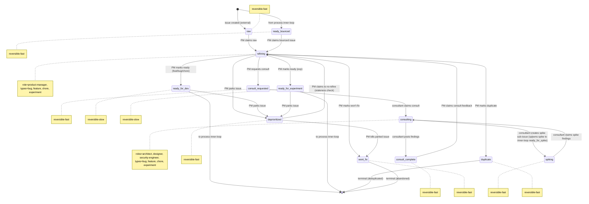

# Process: refinement

> Defined in: `refinement-states.json`

## Issue types accepted

- `bug` — **Bug**: Defect in shipped behavior — something is broken or wrong. Branch prefix `fix/`. Failing test first; reviewer scrutinizes root cause vs surface symptom.
- `chore` — **Chore**: Internal cleanup with no user-visible behavior change: refactors, dependency bumps, lint config. Branch prefix `chore/`. QA may be skipped at reviewer discretion.
- `experiment` — **Experiment**: Flag-gated feature shipped to a cohort for measurement. Branch prefix `exp/`. Requires hypothesis, metric, and cohort up-front. Post-merge owned by product-owner; closes at verdict on the experimentation lifecycle.
- `feature` — **Feature**: New user-facing capability or enhancement to existing behavior. Branch prefix `feat/`. Standard inner-loop flow with no per-step variations.

## State diagram

## States

| Name | Class | Reversibility | Roles | Issue types | Terminal taxonomy | Close reason |
|---|---|---|---|---|---|---|
| `raw` | resting | reversible-fast | — | — | — | — |
| `refining` | working | — | product-manager | bug, feature, chore, experiment | — | — |
| `consult_requested` | resting | reversible-fast | — | — | — | — |
| `consulting` | working | — | architect, designer, security-engineer | bug, feature, chore, experiment | — | — |
| `consult_complete` | resting | reversible-fast | — | — | — | — |
| `spiking` | resting | reversible-fast | — | — | — | — |
| `ready_for_dev` | resting | reversible-slow | — | — | — | — |
| `ready_for_experiment` | resting | reversible-slow | — | — | — | — |
| `ready_bounced` | resting | reversible-fast | — | — | — | — |
| `deprioritized` | resting | reversible-fast | — | — | — | — |
| `duplicate` | terminal | reversible-fast | — | — | deduplicated | not planned |
| `wont_fix` | terminal | reversible-fast | — | — | abandoned | not planned |

## Transitions

| From | To | Type | Label | Gate | HITL level |
|---|---|---|---|---|---|
| `[*]` | `raw` | external | 'issue created (external)' | — | — |
| `[*]` | `ready_bounced` | cross_process | 'from process inner-loop' | — | — |
| `raw` | `refining` | claim | 'PM claims raw' | — | — |
| `refining` | `duplicate` | role_action | 'PM marks duplicate' | — | — |
| `refining` | `wont_fix` | role_action | "PM marks won't-fix" | — | — |
| `refining` | `consult_requested` | role_action | 'PM requests consult' | — | — |
| `consult_requested` | `consulting` | claim | 'consultant claims consult' | — | — |
| `consulting` | `consult_complete` | role_action | 'consultant posts findings' | — | — |
| `consult_complete` | `refining` | claim | 'PM claims consult feedback' | — | — |
| `consulting` | `spiking` | role_action | 'consultant creates spike sub-issue (spawns spike to inner-loop ready_for_spike)' | — | — |
| `spiking` | `consulting` | claim | 'consultant claims spike findings' | — | — |
| `refining` | `ready_for_dev` | role_action | 'PM marks ready (feat/bug/chore)' | — | — |
| `refining` | `ready_for_experiment` | role_action | 'PM marks ready (exp)' | — | — |
| `ready_for_dev` | `[*]` | cross_process | 'to process inner-loop' | — | — |
| `ready_for_experiment` | `[*]` | cross_process | 'to process inner-loop' | — | — |
| `ready_bounced` | `refining` | claim | 'PM claims bounced issue' | — | — |
| `refining` | `deprioritized` | role_action | 'PM parks issue' | — | — |
| `ready_for_dev` | `deprioritized` | role_action | 'PM parks issue' | — | — |
| `ready_for_experiment` | `deprioritized` | role_action | 'PM parks issue' | — | — |
| `deprioritized` | `refining` | claim | 'PM claims to re-refine (staleness check)' | — | — |
| `deprioritized` | `wont_fix` | role_action | 'PM kills parked issue' | — | — |

## Cross-process handoffs

**Entries** (issues arriving from other processes):

- `ready_bounced` ← process `inner-loop` (shared) — `from process inner-loop`

**Exits** (issues handed to other processes):

- `ready_for_dev` → process `inner-loop` (shared) — `to process inner-loop`
- `ready_for_experiment` → process `inner-loop` (shared) — `to process inner-loop`
