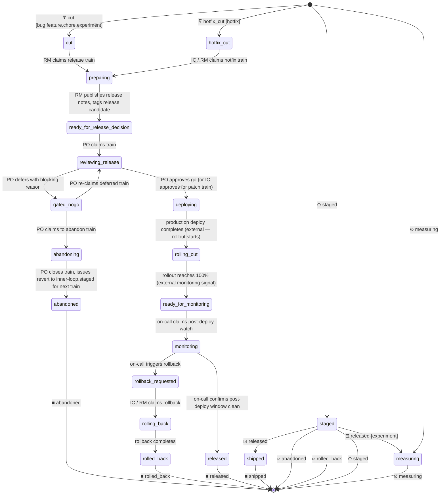

# Process: release

Cut, review, and ship a release train. Dev tickets (bug/feature/chore/experiment/hotfix) are handed off from `inner-loop.staged` and live here as contributors; a release ticket is created at `cut` (or `hotfix_cut`), collects the staged contributors, then runs review → deploy → released. On `released` the contributor tickets cascade to `shipped`; on `abandoned` / `rolled_back` they're returned to the queue for the next train.

> Defined in: `release-states.json`

## Issue types accepted

- `bug` — **Bug**: Defect in shipped behavior — something is broken or wrong. Branch prefix `fix/`. Failing test first; reviewer scrutinizes root cause vs surface symptom.
- `chore` — **Chore**: Internal cleanup with no user-visible behavior change: refactors, dependency bumps, lint config. Branch prefix `chore/`. QA may be skipped at reviewer discretion.
- `experiment` — **Experiment**: Flag-gated feature shipped to a cohort for measurement. Branch prefix `exp/`. Requires hypothesis, metric, and cohort up-front. Post-merge owned by product-owner; closes at verdict on the experimentation lifecycle.
- `feature` — **Feature**: New user-facing capability or enhancement to existing behavior. Branch prefix `feat/`. Standard inner-loop flow with no per-step variations.
- `hotfix` — **Hotfix**: Compressed inner-loop work for urgent production fixes during active incidents. Branch prefix `hotfix/`. Spawned by mitigation under IC authority; skips refinement; QA may be bypassed.
- `release` — **Release**: A release-train work item. Tracks one cut through prep → deploy → monitor; experimentation is a phase that operates on the same release ticket.

## State diagram

## States

| Name | Class | Reversibility | Roles | Issue types | Human inputs | Closure taxonomy | Close reason |
|---|---|---|---|---|---|---|---|
| `staged` | resting | reversible-slow | — | bug, feature, chore, experiment, hotfix | — | — | — |
| `measuring` | resting | reversible-slow | — | experiment | — | — | — |
| `cut` | resting | reversible-slow | — | release | — | — | — |
| `hotfix_cut` | resting | reversible-fast | — | release | — | — | — |
| `preparing` | working | — | release-manager | release | clarify-scope, blocked-on-data, general | — | — |
| `ready_for_release_decision` | resting | reversible-slow | — | release | — | — | — |
| `reviewing_release` | working | — | product-owner | release | needs-security-review, blocked-on-data, general | — | — |
| `gated_nogo` | resting | reversible-fast | — | release | — | — | — |
| `abandoning` | working | — | product-owner | release | general | — | — |
| `abandoned` | resting | reversible-fast | — | — | — | abandoned | not planned |
| `deploying` | resting | reversible-slow | — | release | — | — | — |
| `rolling_out` | resting | reversible-slow | — | release | — | — | — |
| `ready_for_monitoring` | resting | reversible-slow | — | release | — | — | — |
| `monitoring` | working | — | developer | release | blocked-on-data, general | — | — |
| `rollback_requested` | resting | reversible-fast | — | release | — | — | — |
| `rolling_back` | working | — | incident-commander, release-manager | release | clarify-scope, needs-arch-review, blocked-on-data, general | — | — |
| `rolled_back` | resting | reversible-slow | — | — | — | reverted | completed |
| `released` | resting | reversible-slow | — | — | — | shipped | completed |
| `shipped` | resting | reversible-slow | — | — | — | shipped | completed |

## Transitions

| From | To | Type | Label | Gate | HITL level |
|---|---|---|---|---|---|
| `cut` | `preparing` | claim | 'RM claims release train' | — | — |
| `hotfix_cut` | `preparing` | claim | 'IC / RM claims hotfix train' | — | — |
| `preparing` | `ready_for_release_decision` | advance | 'RM publishes release notes, tags release candidate' | — | — |
| `ready_for_release_decision` | `reviewing_release` | claim | 'PO claims train' | — | — |
| `reviewing_release` | `gated_nogo` | advance | 'PO defers with blocking reason' | — | — |
| `reviewing_release` | `deploying` | advance | 'PO approves go (or IC approves for patch train)' | — | — |
| `gated_nogo` | `reviewing_release` | claim | 'PO re-claims deferred train' | — | — |
| `gated_nogo` | `abandoning` | claim | 'PO claims to abandon train' | — | — |
| `abandoning` | `abandoned` | advance | 'PO closes train, issues revert to inner-loop.staged for next train' | — | — |
| `deploying` | `rolling_out` | event | 'production deploy completes (external — rollout starts)' | — | — |
| `rolling_out` | `ready_for_monitoring` | event | 'rollout reaches 100% (external monitoring signal)' | — | — |
| `ready_for_monitoring` | `monitoring` | claim | 'on-call claims post-deploy watch' | — | — |
| `monitoring` | `released` | advance | 'on-call confirms post-deploy window clean' | — | — |
| `monitoring` | `rollback_requested` | advance | 'on-call triggers rollback' | — | — |
| `rollback_requested` | `rolling_back` | claim | 'IC / RM claims rollback' | — | — |
| `rolling_back` | `rolled_back` | advance | 'rollback completes' | — | — |

## Cross-process interfaces

### Inbound

| State | Kind | From | Detail |
|---|---|---|---|
| `cut` | ꘜ collect | this process · `staged` | types `bug`, `feature`, `chore`, `experiment`; on `released`: `*`→`shipped`, `experiment`→`measuring`; on `abandoned` → released; on `rolled_back` → released |
| `hotfix_cut` | ꘜ collect | this process · `staged` | types `hotfix`; on `released` → `shipped`; on `abandoned` → released; on `rolled_back` → released |
| `staged` | ⊙ handoff | partner process(es) | shared resting state (also outbound) |
| `measuring` | ⊙ handoff | partner process(es) | shared resting state (also outbound) |

### Outbound

| State | Kind | To | Detail |
|---|---|---|---|
| `staged` | ⊙ handoff | partner process(es) | shared resting state (also inbound) |
| `measuring` | ⊙ handoff | partner process(es) | shared resting state (also inbound) |
| `abandoned` | ■ exit | — (closes) | abandoned; closes `not planned` |
| `rolled_back` | ■ exit | — (closes) | reverted; closes `completed` |
| `released` | ■ exit | — (closes) | shipped; closes `completed` |
| `shipped` | ■ exit | — (closes) | shipped; closes `completed` |
