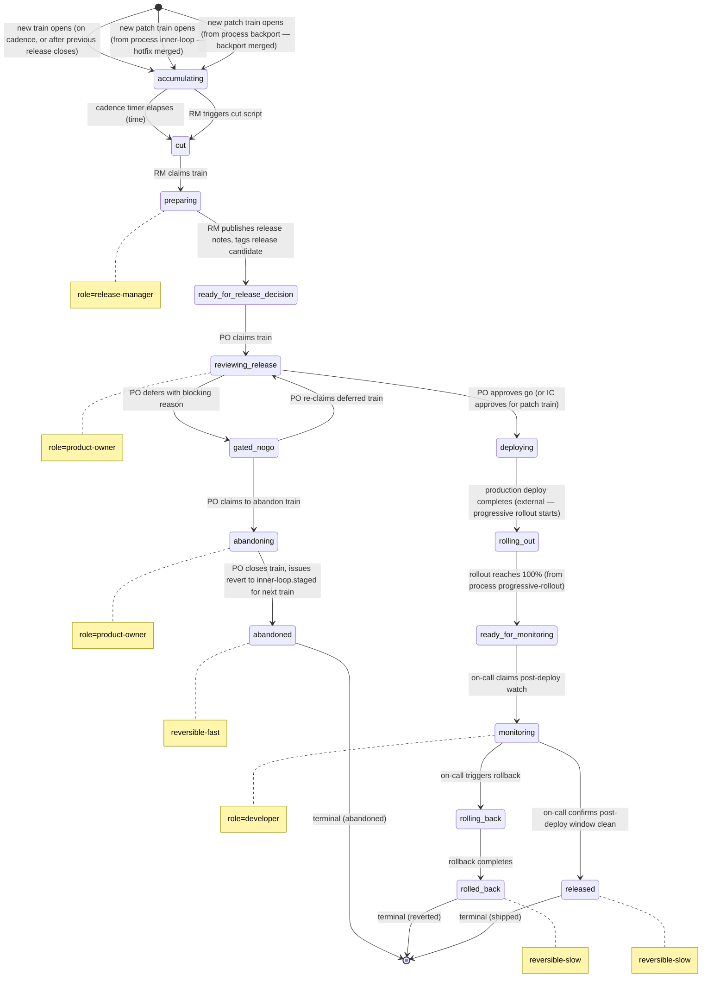

# Process: release

> Defined in: `release-states.json`

## State diagram

## States

| Name | Class | Reversibility | Roles | Issue types | Terminal taxonomy | Close reason |
|---|---|---|---|---|---|---|
| `accumulating` | resting | — | — | — | — | — |
| `cut` | resting | — | — | — | — | — |
| `preparing` | working | — | release-manager | — | — | — |
| `ready_for_release_decision` | resting | — | — | — | — | — |
| `reviewing_release` | working | — | product-owner | — | — | — |
| `gated_nogo` | resting | — | — | — | — | — |
| `abandoning` | working | — | product-owner | — | — | — |
| `abandoned` | terminal | reversible-fast | — | — | abandoned | not planned |
| `deploying` | resting | — | — | — | — | — |
| `rolling_out` | resting | — | — | — | — | — |
| `ready_for_monitoring` | resting | — | — | — | — | — |
| `monitoring` | working | — | developer | — | — | — |
| `rolling_back` | working | — | — | — | — | — |
| `rolled_back` | terminal | reversible-slow | — | — | reverted | completed |
| `released` | terminal | reversible-slow | — | — | shipped | completed |

## Transitions

| From | To | Type | Label | Gate | HITL level |
|---|---|---|---|---|---|
| `[*]` | `accumulating` | external | 'new train opens (on cadence, or after previous release closes)' | — | — |
| `[*]` | `accumulating` | cross_process | 'new patch train opens (from process inner-loop — hotfix merged)' | — | — |
| `[*]` | `accumulating` | cross_process | 'new patch train opens (from process backport — backport merged)' | — | — |
| `accumulating` | `cut` | external | 'cadence timer elapses (time)' | — | — |
| `accumulating` | `cut` | external | 'RM triggers cut script' | — | — |
| `cut` | `preparing` | claim | 'RM claims train' | — | — |
| `preparing` | `ready_for_release_decision` | role_action | 'RM publishes release notes, tags release candidate' | — | — |
| `ready_for_release_decision` | `reviewing_release` | claim | 'PO claims train' | — | — |
| `reviewing_release` | `gated_nogo` | role_action | 'PO defers with blocking reason' | — | — |
| `reviewing_release` | `deploying` | role_action | 'PO approves go (or IC approves for patch train)' | — | — |
| `gated_nogo` | `reviewing_release` | claim | 'PO re-claims deferred train' | — | — |
| `gated_nogo` | `abandoning` | claim | 'PO claims to abandon train' | — | — |
| `abandoning` | `abandoned` | role_action | 'PO closes train, issues revert to inner-loop.staged for next train' | — | — |
| `deploying` | `rolling_out` | external | 'production deploy completes (external — progressive rollout starts)' | — | — |
| `rolling_out` | `ready_for_monitoring` | external | 'rollout reaches 100% (from process progressive-rollout)' | — | — |
| `ready_for_monitoring` | `monitoring` | claim | 'on-call claims post-deploy watch' | — | — |
| `monitoring` | `released` | role_action | 'on-call confirms post-deploy window clean' | — | — |
| `monitoring` | `rolling_back` | role_action | 'on-call triggers rollback' | — | — |
| `rolling_back` | `rolled_back` | role_action | 'rollback completes' | — | — |

## Cross-process handoffs

**Entries** (issues arriving from other processes):

- `accumulating` ← process `inner-loop` (spawn) — `new patch train opens (from process inner-loop — hotfix merged)`
- `accumulating` ← process `backport` (spawn) — `new patch train opens (from process backport — backport merged)`
